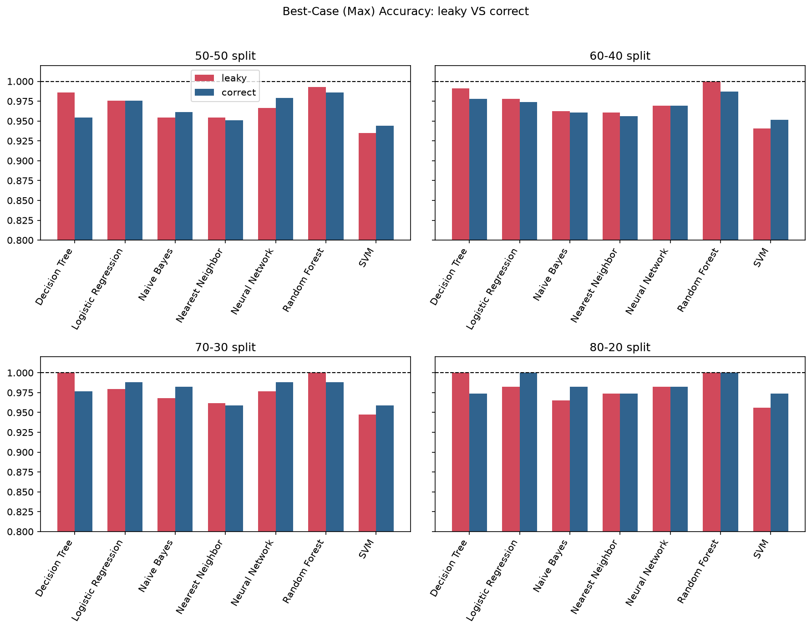
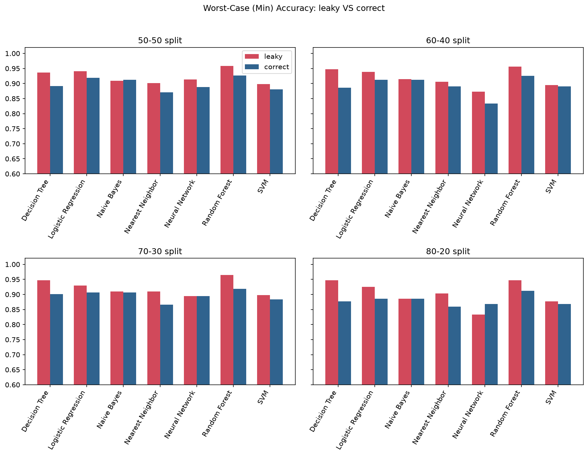

# Cancer ML Leakage Demo

A small, reproducible experiment showing how **data duplication before a train/test split** inflates reported accuracy on the Wisconsin Diagnostic Breast Cancer (WDBC) dataset, and why the *worst-case* accuracy is a more honest number than the best case.

This project replicates the methodology from section 4.2 ("Doubling the dataset") of Patgiri et al., [*Machine Learning: A Dark Side of Cancer Computing*](https://arxiv.org/abs/1903.07167), then repeats the same experiment with the leakage fixed and compares the two side by side.

---

## The idea in 30 seconds

The paper shows that simply doubling the WDBC dataset before splitting can push some models to 100% accuracy. That is not a better model; it is a model being tested on rows it has already seen.

Both pipelines use the same seven models, the same four split ratios (50-50, 60-40, 70-30, 80-20), and 100 repeated random splits per ratio. The only thing that changes is the order of operations.

---

## Key results

Numbers below come from `results/tables/leaky_vs_correct_comparison.csv`, averaged over the four split ratios.

| Model | Mean acc. (leaky) | Mean acc. (correct) | Δ mean (pts) | Min acc. (leaky) | Min acc. (correct) | Δ min (pts) |
|---|---|---|---|---|---|---|
| Decision Tree | 97.6% | 93.1% | **+4.5** | 94.5% | 88.9% | **+5.6** |
| Random Forest | 98.7% | 96.0% | **+2.7** | 95.7% | 92.1% | **+3.6** |
| Nearest Neighbor | 93.9% | 92.4% | +1.5 | 90.5% | 87.1% | +3.4 |
| Logistic Regression | 95.7% | 95.1% | +0.6 | 93.4% | 90.6% | +2.8 |
| Neural Network | 93.9% | 93.4% | +0.5 | 87.9% | 87.1% | +0.8 |
| SVM | 92.1% | 91.8% | +0.3 | 89.2% | 88.1% | +1.1 |
| Naive Bayes | 94.0% | 93.9% | +0.1 | 90.5% | 90.4% | +0.0 |

What stands out:

- **Leakage produces "perfect" scores.** Under the leaky pipeline, 5 of 28 (split, model) combinations reach 100% best-case accuracy, all of them Random Forest or Decision Tree. With the leakage fixed, only 2 of 28 do, both on the smallest test set (80-20, about 114 test rows), where a lucky perfect run is plausible without any leakage.
- **The mean is inflated in every single comparison.** In all 28 (split, model) pairs the leaky mean accuracy is at or above the correct one.
- **Models that can memorise benefit most.** Decision Tree, Random Forest and Nearest Neighbor gain the most; Naive Bayes, SVM and the Neural Network barely move. This is consistent with duplicates being most useful to models that can fit individual training points, but this repo does not test that explanation directly.
- **Best-case accuracy is a noisy signal.** For several models (Logistic Regression, Naive Bayes, Neural Network, SVM) the *max* accuracy is actually higher in the correct pipeline on average, because a maximum over 100 runs is an extreme value. Mean and minimum accuracy are far more stable, which is the paper's argument for reporting minimum accuracy when the task is diagnosing a disease.

### Best case (max) accuracy: leaky vs correct



### Worst case (min) accuracy: leaky vs correct



Full per-split numbers for every model are in [`results/tables/`](results/tables/).

---

## Quickstart

This project is managed with [uv](https://docs.astral.sh/uv/) and requires Python 3.14 or newer (uv will fetch it automatically if it is not installed).

```bash
git clone https://github.com/Ranuth-Nanvidu/cancer-ml-leakage-demo.git
cd cancer-ml-leakage-demo

uv sync              # create the virtualenv and install pinned dependencies
uv run jupyter lab   # open the notebooks
```

Then run the notebooks in order:

| Notebook | What it does |
|---|---|
| `notebooks/01_eda.ipynb` | Explores WDBC: class balance, feature scales, feature correlations. |
| `notebooks/02_leaky_pipeline.ipynb` | Reproduces the paper's duplicate-then-split setup and saves `leaky_summary.csv`. |
| `notebooks/03_correct_pipeline.ipynb` | Runs the identical experiment with split-then-duplicate and saves `correct_summary.csv`. |
| `notebooks/04_max_vs_min_accuracy.ipynb` | Loads both CSVs, builds the comparison table and the max/min accuracy charts. |

Notebook 04 reads the CSVs written by 02 and 03, so run those first. The generated tables and figures are already committed under `results/`, so you can see the outcome without re-running anything.

### Using the package directly

The experiment logic lives in an importable package, so you can run it without the notebooks:

```python
from cancer_ml_leakage_demo.data import load_data
from cancer_ml_leakage_demo.leakage import leaky_split, correct_split
from cancer_ml_leakage_demo.metrics import run_experiment, summarize

X, y = load_data()

leaky = summarize(run_experiment(X, y, split_fn=leaky_split, test_size=0.2, n_rounds=100))
correct = summarize(run_experiment(X, y, split_fn=correct_split, test_size=0.2, n_rounds=100))

print(leaky)
print(correct)
```

---

## Project structure

```
cancer-ml-leakage-demo/
├── pyproject.toml
├── uv.lock
├── .python-version
├── README.md
│
├── paper/
│   └── 1903.07167v1.pdf              # the paper being replicated
│
├── notebooks/
│   ├── 01_eda.ipynb                  # dataset exploration
│   ├── 02_leaky_pipeline.ipynb       # duplicate -> split (the bug)
│   ├── 03_correct_pipeline.ipynb     # split -> duplicate train only (the fix)
│   └── 04_max_vs_min_accuracy.ipynb  # side-by-side comparison
│
├── src/cancer_ml_leakage_demo/
│   ├── data.py                       # loads WDBC via scikit-learn, stratified split helper
│   ├── leakage.py                    # duplicate_dataset, leaky_split, correct_split
│   ├── models.py                     # the seven classifiers, freshly built each round
│   └── metrics.py                    # run_experiment and summarize (mean / max / min)
│
└── results/
    ├── figures/                      # PNG charts produced by the notebooks
    └── tables/                       # leaky, correct and merged comparison CSVs
```

The core of the demo is [`src/cancer_ml_leakage_demo/leakage.py`](src/cancer_ml_leakage_demo/leakage.py): `leaky_split` and `correct_split` differ only in whether duplication happens before or after the split.

---

## Method details

- **Dataset:** WDBC from `sklearn.datasets.load_breast_cancer`: 569 samples, 30 numeric features, 212 malignant and 357 benign. Labels are remapped so `1 = malignant` and `0 = benign`.
- **Models:** Naive Bayes, k-Nearest Neighbors (k=5), Logistic Regression, Decision Tree (entropy criterion), Random Forest (100 trees), SVM, and an MLP neural network, all with scikit-learn defaults except where stated in `models.py`.
- **Splits:** 50-50, 60-40, 70-30 and 80-20, each **stratified** on the label because the classes are imbalanced.
- **Repetitions:** 100 rounds per split ratio. In each round the split seed and the model seeds are set to the round number, so results are reproducible.
- **Metrics:** accuracy per round, summarised as mean, max (best case) and min (worst case) per model and split.

---

## Notes and limitations

- **This replicates the methodology, not the paper's exact figures.** Library versions, seeds and implementation details differ, so individual numbers will not match the paper's.
- **Seven models, not the paper's full list.** The paper also includes a Decision Tree regressor, which is not implemented here.
- **No un-duplicated baseline in the notebooks.** The comparison is leaky vs correct. A plain baseline is one call away using `simple_split` from `data.py` if you want to add one.
- **Test set sizes differ between pipelines.** The leaky pipeline splits the doubled dataset (1,138 rows), so its test sets are twice as large as the correct pipeline's. That makes the spread between best and worst case not directly comparable; the mean and worst-case accuracy comparisons are the cleaner signals.
- **The correct pipeline still duplicates the training half.** This is deliberate, to keep training set sizes comparable with the leaky pipeline. The duplication can never reach the test set.

---

## Reference

Ripon Patgiri, Sabuzima Nayak, Tanya Akutota, and Bishal Paul. *Machine Learning: A Dark Side of Cancer Computing.* Int'l Conf. Bioinformatics and Computational Biology (BIOCOMP'18). [arXiv:1903.07167](https://arxiv.org/abs/1903.07167). A copy is included in [`paper/`](paper/).

## Author

Ranuth Nanvidu ([@Ranuth-Nanvidu](https://github.com/Ranuth-Nanvidu))